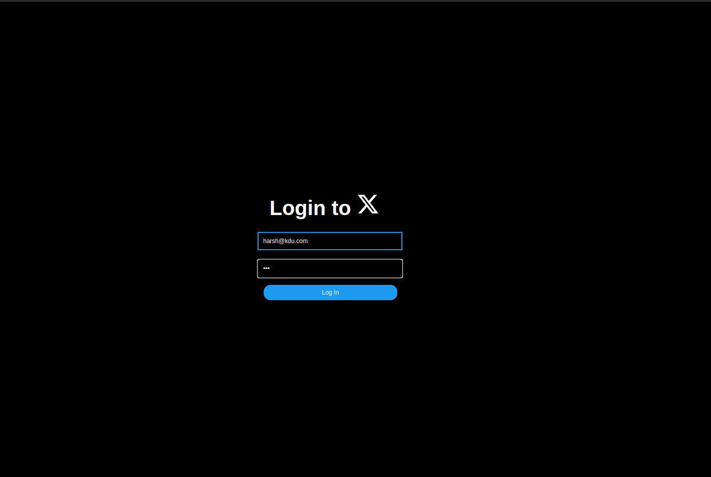

## Assignment 2
/**
 * This is the main server file for the application, responsible for setting up the
 * Express server, configuring middleware, and defining API endpoints.
 * 
 * Dependencies:
 * - express: Framework for creating the server and handling HTTP requests.
 * - cors: Middleware to enable Cross-Origin Resource Sharing (CORS).
 * - body-parser: Middleware to parse incoming request bodies before handlers.
 * - User, Post: Models for handling user and post data.
 * - authController, postController: Controllers for handling authentication and post-related operations.
 * - io: Utility for messaging functionality, presumably using Socket.io for real-time communication.
 * - timeUtils: Utility module for time-related functions.
 * 
 * The server supports various API endpoints for user authentication and post management,
 * alongside setting up a separate channel for real-time messaging.
 * 
 * API Endpoints:
 * 
 * User Authentication:
 * - POST /api/user/login: Allows users to log in by providing email and password.
 *   The authController handles the authentication logic.
 * - GET /api/user/login/status: Checks the login status of the current user.
 *   This could be used to maintain session state or for token validation.
 * 
 * Post Management:
 * - POST /api/post: Enables the creation of new posts. The postController manages
 *   the logic for creating and storing post data.
 * - GET /api/post: Retrieves a list of posts. Useful for displaying posts in a feed.
 * - GET /api/post/:id: Retrieves a specific post by its unique identifier.
 * 
 * Real-Time Messaging:
 * - The server uses Socket.io (or a similar library) to listen on port 3001 for real-time
 *   messaging features. This could include chat functionality, live updates, or notifications.
 * 
 * The server listens on a specified PORT environment variable or defaults to port 3000
 * for HTTP requests. The real-time messaging service listens on port 3001.
 * 
 * Usage:
 * To start the server, ensure you have Node.js installed and run `node server.js` from
 * the command line in the project directory. Make sure all dependencies are installed
 * by running `npm install` before starting the server.
 */

## folder structure : 
](readme_images/folderStructure.png)

## output :

**server running**
](readme_images/server.png)

**login**

**message section**
](readme_images/messagesection.png)

**on clicking post we can come back top home screen**
](readme_images/postOnclick.png)

\](home.png)](readme_images/home.png)