# Real-Time Stock Market Application

A dynamic stock market application developed with React and Node.js, providing real-time updates on stock data. This project integrates frontend and backend via sockets for live data feeds, and leverages React for the UI, styled-components for styling, and a Node.js server for backend logic.

## Table of Contents

- [Real-Time Stock Market Application](#real-time-stock-market-application)
  - [Table of Contents](#table-of-contents)
  - [Introduction](#introduction)
  - [Setup and Installation](#setup-and-installation)
    - [Prerequisites](#prerequisites)
    - [Steps](#steps)
  - [Project Structure](#project-structure)
    - [Client](#client)
    - [Server](#server)
  - [API Endpoints](#api-endpoints)
  - [Features and Functionalities](#features-and-functionalities)
    - [Dashboard](#dashboard)
    - [WatchList](#watchlist)
    - [Stock Page](#stock-page)
    - [My Portfolio Page](#my-portfolio-page)
    - [Stock Summarizer Page](#stock-summarizer-page)
  - [Author :](#author-)
    - [Harsh Mishra](#harsh-mishra)

## Introduction

This project aims to provide users with a real-time view of the stock market, enabling them to track stock data, manage a portfolio, and make informed trading decisions. The application is split into a client-side React application and a Node.js backend server, communicating over WebSockets to provide live updates.

## Setup and Installation

To get the application running locally:

### Prerequisites

- Node.js
- npm or yarn

### Steps

1. **Clone the repository**

```
git clone <repository-url>
```

2. **Install dependencies**
Navigate to both the client and server directories in separate terminal windows and run:
```
npm install
```
3. **Start the server**
In the server directory:
```
npm start
```
4. **Run the client application**
In the client directory:

```
npm run dev
```

The application should now be running locally on your machine.

## Project Structure
The project is divided into two main directories: client and server.


### Client
Located in the client folder, this React application is structured as follows:

```
└── 📁client
    └── .eslintrc.cjs
    └── .gitignore
    └── README.md
    └── index.html
    └── package-lock.json
    └── package.json
    └── 📁public
        └── service-worker.js
    └── 📁src
        └── App.css
        └── App.tsx
        └── 📁Context
            └── StockContext.tsx
        └── 📁assets
            └── logo.jpg
        └── 📁components
            └── 📁Loader
                └── Loader.styles.ts
                └── Loader.tsx
            └── 📁Navbar
                └── Navbar.styles.ts
                └── Navbar.tsx
        └── 📁features
            └── 📁Summarizer
                └── Summarizer.styles.ts
                └── Summarizer.tsx
            └── 📁dashboard
                └── Dashboard.styles.ts
                └── Dashboard.tsx
                └── 📁Stocklist
                    └── StockList.tsx
                    └── stocklist.styles.ts
                └── 📁Watchlist
                    └── WatchList.tsx
                    └── watchlist.styles.ts
            └── 📁portfolio
                └── Portfolio.styles.ts
                └── Portfolio.tsx
            └── 📁stock
                └── StockDetail.tsx
                └── StockStyles.ts
        └── index.css
        └── main.tsx
        └── 📁type
            └── stocks.ts
        └── 📁utils
            └── LocalStoragePersistenceFunctions.ts
        └── vite-env.d.ts
    └── tsconfig.json
    └── tsconfig.node.json
    └── vite.config.ts
```

- src: Contains all the source files.
 ```
└── 📁server
    └── package-lock.json
    └── package.json
    └── 📁src
        └── app.js
        └── app.ts
        └── 📁controllers
            └── userController.ts
        └── 📁models
        └── 📁routes
            └── userRoutes.ts
        └── 📁services
            └── stockService.ts
```
- components: Reusable UI components.
- features: Feature-specific components and logic.
- Context: React context providers.
- assets: Static files like images.
- utils: Utility functions.
- type: TypeScript type definitions.
- public: Public files like the service worker script.

### Server
Located in the server folder, structured as follows:

- src: Contains the source code for the server.
- controllers: Functions to respond to incoming requests.
- models: Database models (if any).
- routes: API route definitions.
- services: Business logic.

## API Endpoints
The application utilizes the following API endpoints for data:

- Dashboard: `https://dev-9x9ul9opv3e623n.api.raw-labs.com/mock/2`
- My Portfolio: `https://dev-9x9ul9opv3e623n.api.raw-labs.com/mock/3`
- Summarizer: `https://dev-9x9ul9opv3e623n.api.raw-labs.com/mock/4`


## Features and Functionalities
### Dashboard
Serves as the landing page, displaying a list of stocks, a watchlist, and enabling users to add or remove stocks from their watchlist.

- While Loading
- 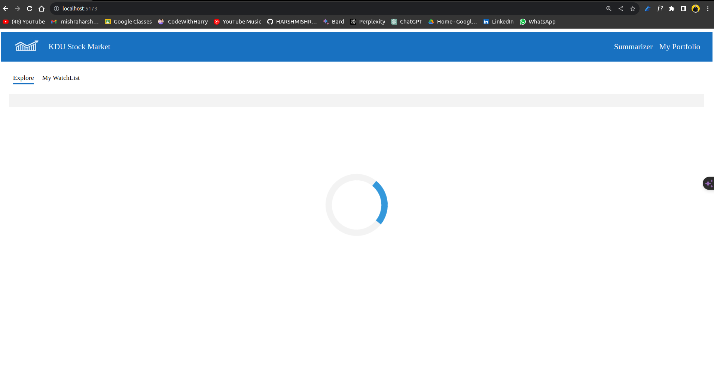

- After Loading
- 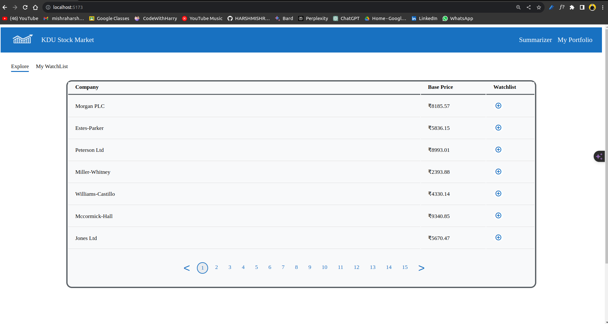

- On changing page and adding stocks and hovering on it : 
- 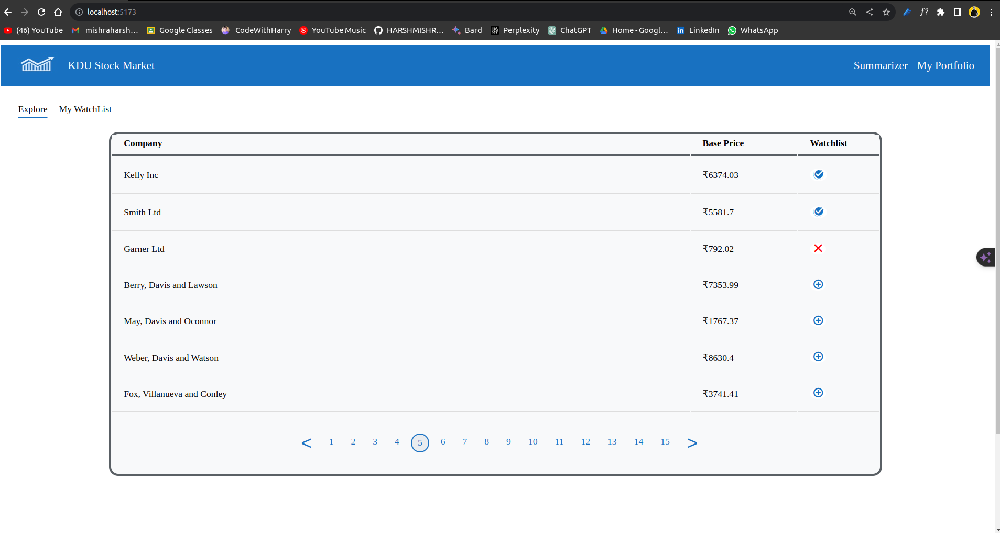

### WatchList 
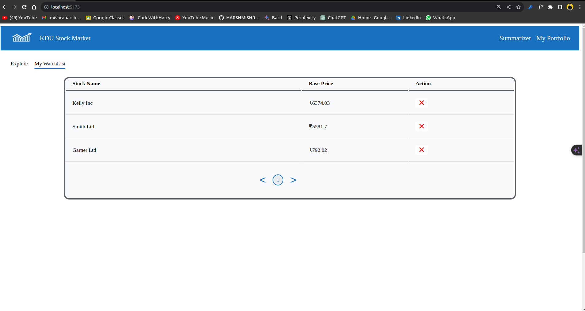

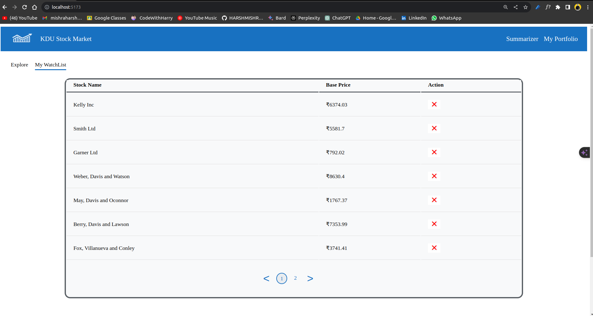

### Stock Page
Allows users to view detailed information about a stock, buy/sell stocks, and view transaction history and live notifications.

- Before Entering into the stock page by cliking on the stock in dashboard
- 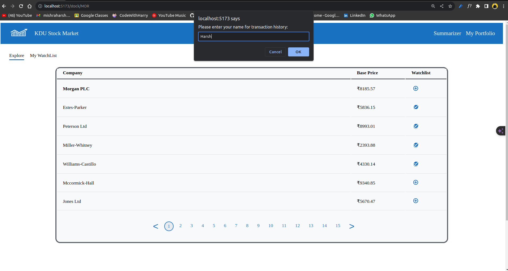

- 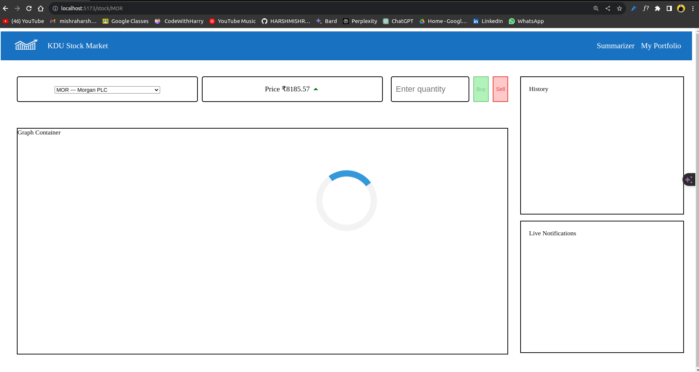
- 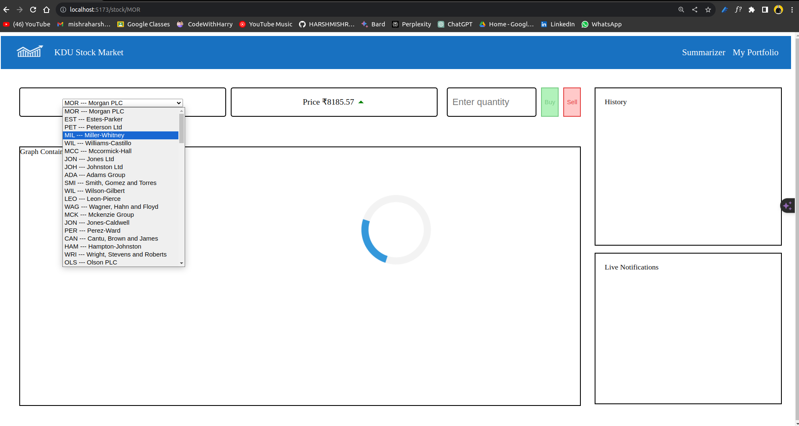
- 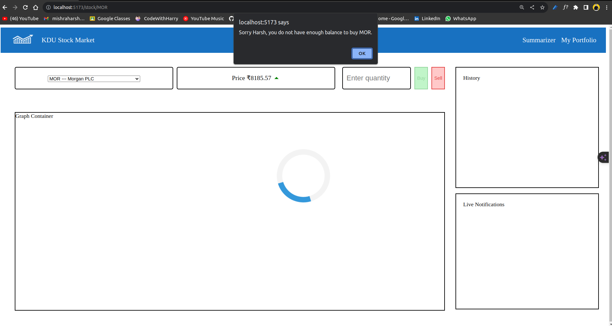
- 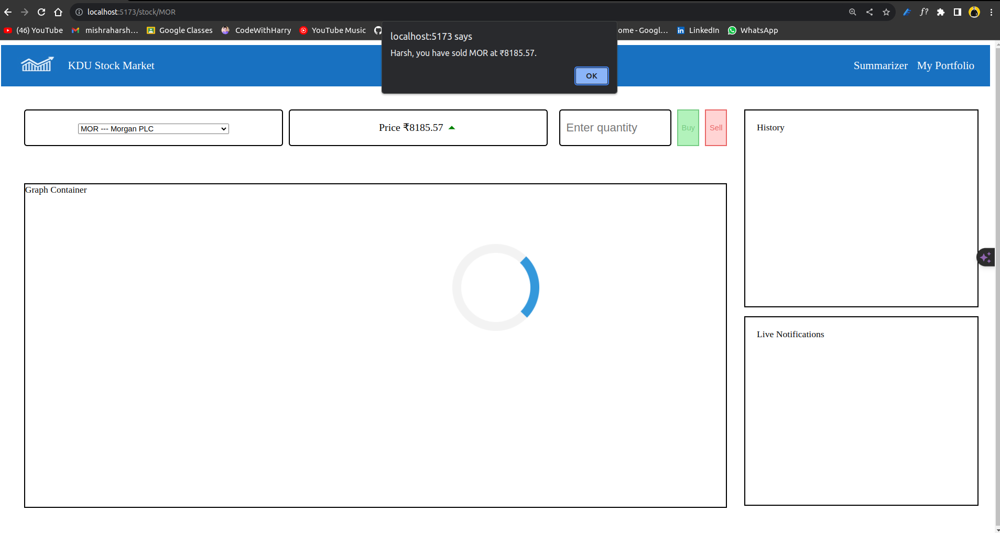
- 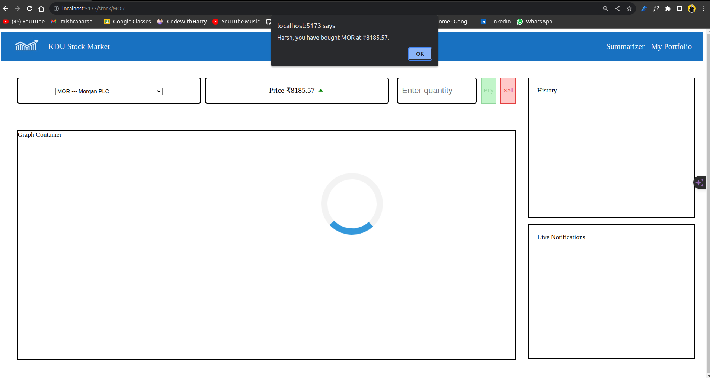
### My Portfolio Page
Displays the user's transaction history, including both successful and failed transactions, with filtering capabilities.

- On loading
- 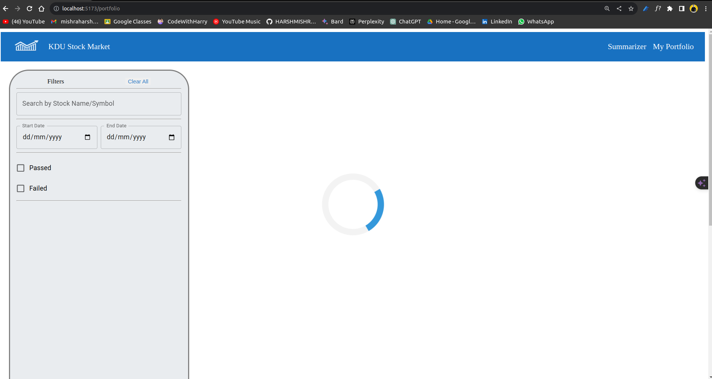

- 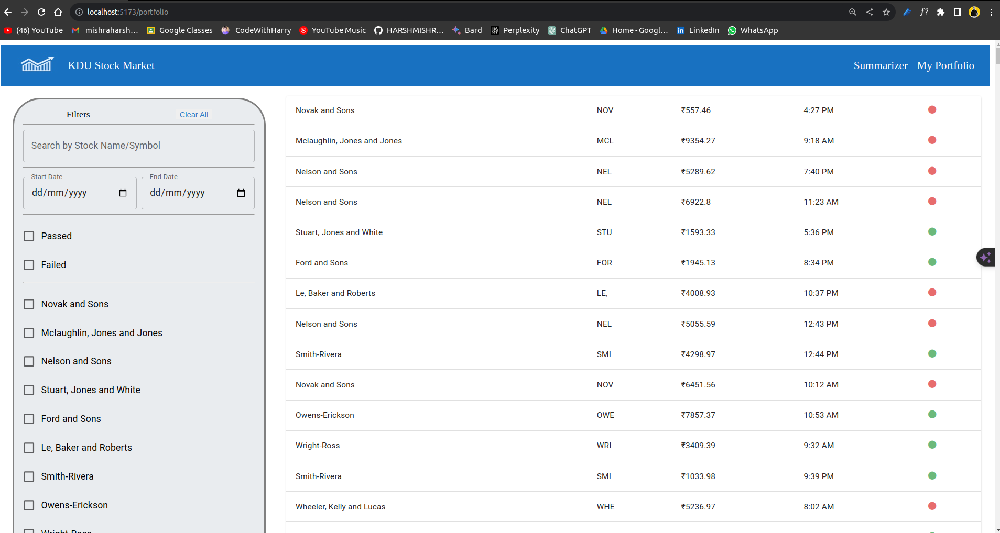
- 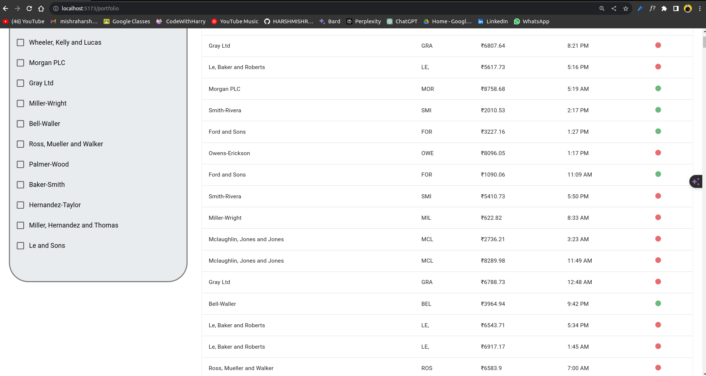
- 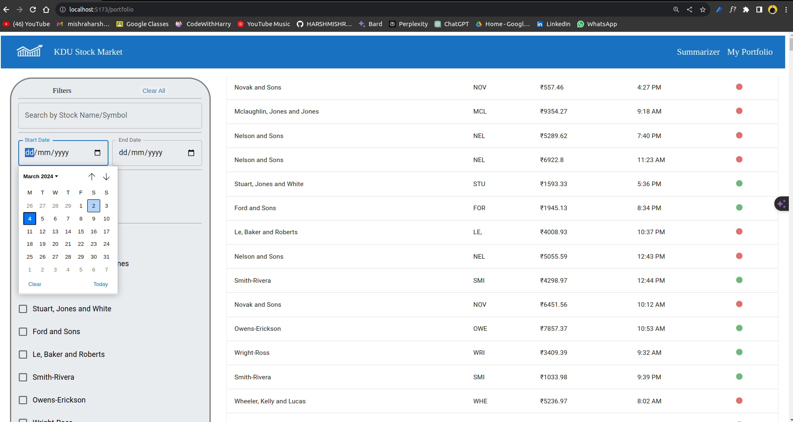
- 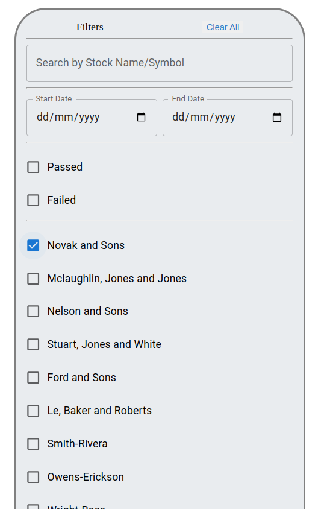

### Stock Summarizer Page
(Bonus) Analyzes stock data to suggest optimal buy and sell dates for maximum profit, computed in a Service Worker.

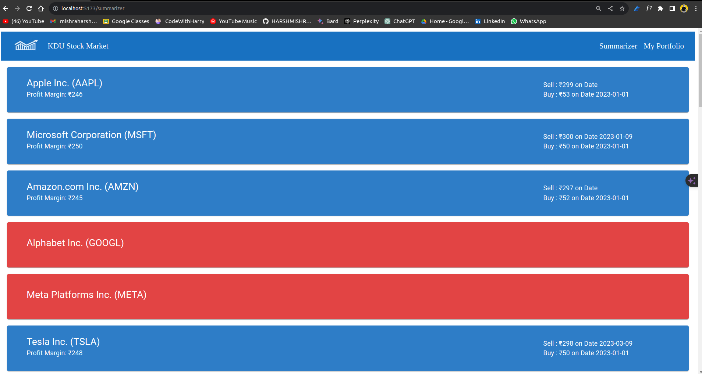

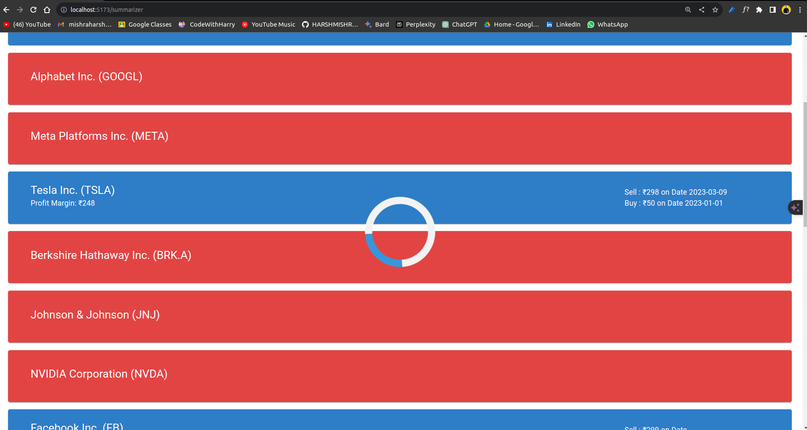


## Author : 
### Harsh Mishra