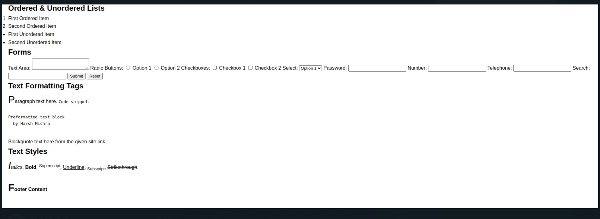
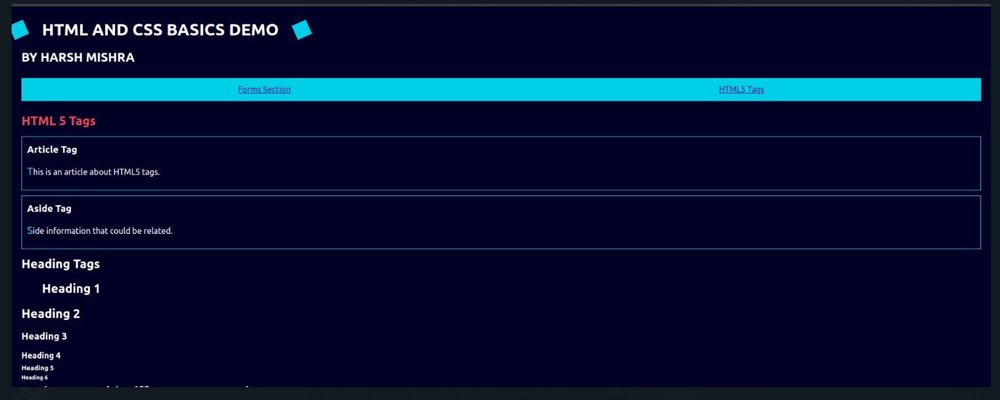
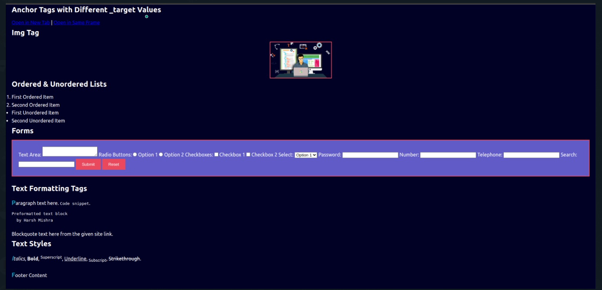

# HTML & CSS Basics Demo

This project showcases the fundamentals of HTML and CSS, including the use of various HTML tags and CSS properties to create a well-structured and styled web page. The demonstration covers a wide range of HTML elements such as forms, lists, images, and HTML5 semantic tags, as well as CSS styling techniques including selectors, the box model, and animations.

## Features

- **HTML Elements**: Demonstrates the use of various HTML tags including forms with different input types, lists, images, and HTML5 semantic elements like `header`, `footer`, `aside`, `article`, `nav`, `section`, and `main`.
- **CSS Styling**: Utilizes CSS for styling, including the use of selectors (ID, class, tag), pseudo-selectors, pseudo-elements, and the CSS box model. Additionally, showcases CSS animations.

- **CSS**: This project showcases the basic usage of CSS, including selectors and properties. It includes a variety of styling elements such as colors, fonts, sizes, margins/padding, align- Basic HTML structure with a title and heading.
-  **RESET.CSS**: This project uses CSS resetting to ensure that all elements have the same baseline styles. It helps in creating a consistent layout across- Basic structure of an HTML page with a title and headings.
   
-  This project is a simple demonstration of the basic features of HTML and CSS. 
-  It includes:- Basic HTML structure with a heading and paragraph.This project demonstrates the basic usage of HTML and CSS.
-   It includes a simple webpage with an image- Basic understanding of HTML and CSS.
-   Basic HTML structure with a heading and paragraph.
-   Basic HTML structure with a title and paragraph.

## Sections

- **HTML5 Tags**: Showcases the use of HTML5 semantic tags.
- **Forms**: Includes a variety of form elements such as text areas, radio buttons, checkboxes, select menus, and more.
- **Text Formatting**: Demonstrates the use of different tags for text formatting including paragraphs, preformatted text, blockquotes, and code snippets.
- **Text Styles**: Utilizes HTML tags to apply styles like italics, bold, superscript, underline, subscript, and strikethrough.
- **Lists**: Presents ordered and unordered lists.
- **Images**: Displays how to use the `img` tag to include images.
- **Navigation**: Features a navigation bar using the `nav` tag and lists.

## Screenshots
*Screenshot of the HTML & CSS Basics Demo web page.*

- Without CSS
 
 

-
 - With CSS
  


## Code Snippets

### HTML5 Structural Tags

```
html

<header>
    <h1>HTML AND CSS BASICS DEMO</h1>
    <h2>BY HARSH MISHRA</h2>
</header>
```
## CSS Rotating Box Animation
```
.rotating-box {
    animation: rotate 4s infinite linear;
}
@keyframes rotate {
    to {
        transform: rotate(360deg);
    }
}

```

## How to Use
- Clone this repository to your local machine.
- Open index.html in your preferred web browser to view the project.
- Explore the code in index.html and style.css to understand the implementation of various HTML tags and CSS properties.

## Author
# ** Harsh Mishra **