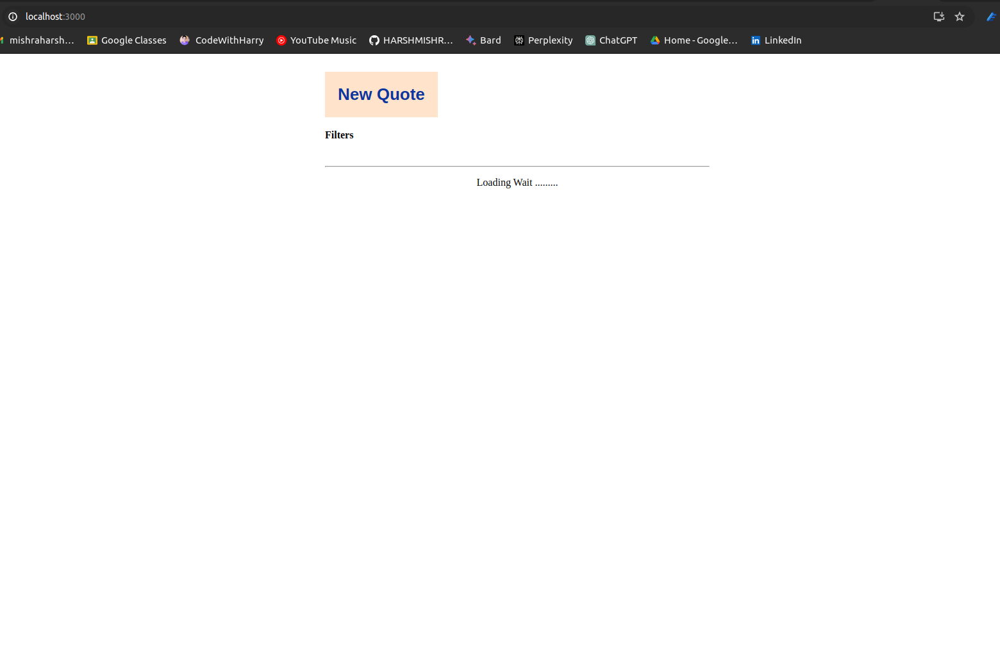
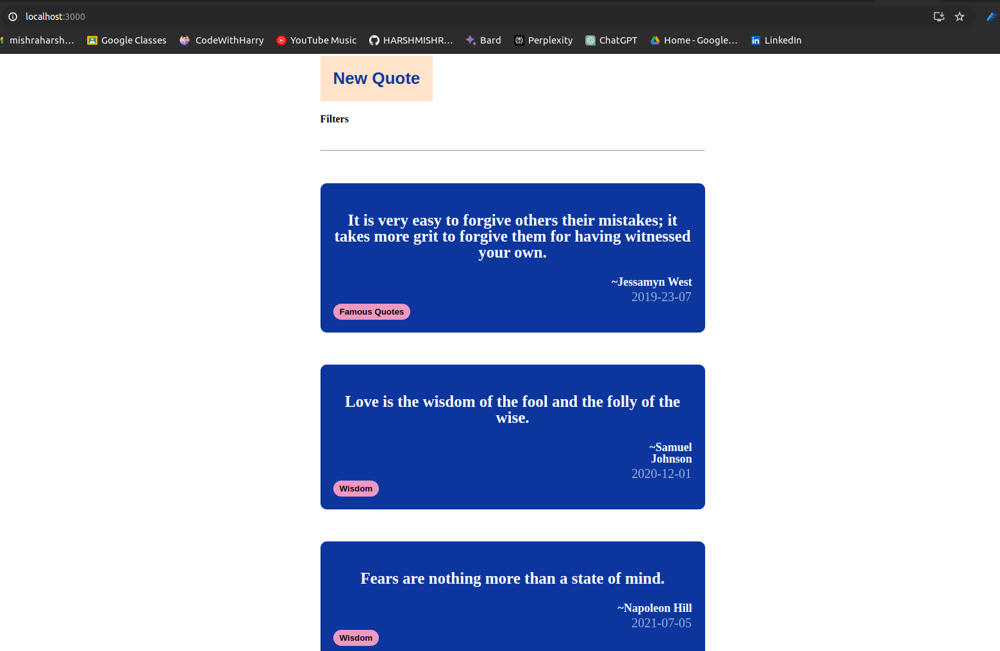
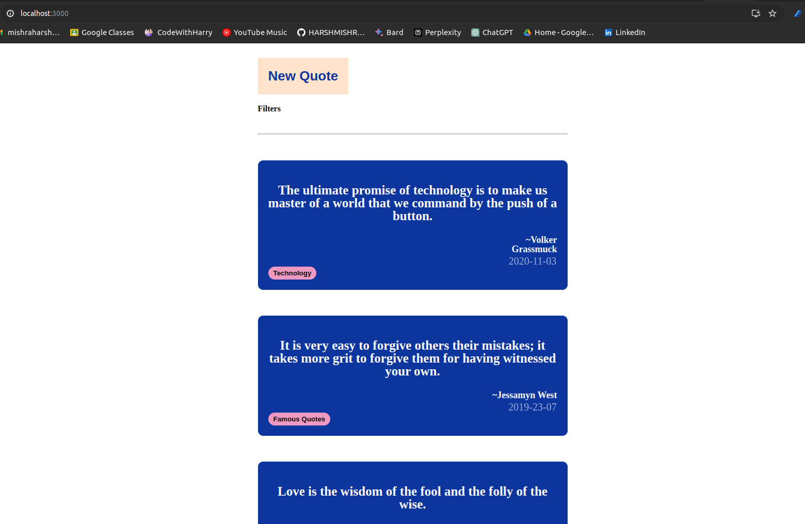
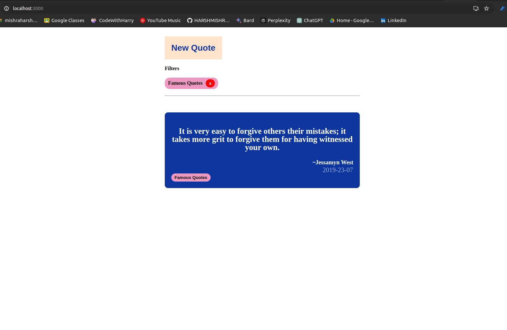

# Quote App - Readme

This document describes the structure and functionality of a Quote App built with React.

## Table of Contents
- [Quote App - Readme](#quote-app---readme)
  - [Table of Contents](#table-of-contents)
  - [Folder Structure](#folder-structure)
  - [Technologies](#technologies)
  - [Functionality](#functionality)
  - [Additional Notes](#additional-notes)
  - [Getting Started](#getting-started)
    - [SCREENSHOTS  :](#screenshots--)
  - [Author](#author)
    - [`HARSH MISHRA`](#harsh-mishra)

## Folder Structure

Below is the folder structure for the Quote App project:

```
src/
├── api/
│ ├── quotesApi.tsx # Handles API interactions for fetching and adding quotes.
│ └── quotes.type.tsx # Defines the interface for quote data structure.
├── components/
│ ├── Filter/
│ │ ├── Filter.tsx # Renders a filter component to manage selected tags.
│ │ └── Filter.scss # Styles the filter component.
│ ├── Header/
│ │ ├── Header.tsx # Manages the app header, including actions like adding quotes.
│ │ └── Header.scss # Styles the header component.
│ ├── Quote/
│ │ ├── Quote.tsx # Renders individual quote details and styling.
│ │ └── Quote.scss # Styles the quote component.
│ ├── QuoteList/
│ │ ├── QuoteList.tsx # Fetches and displays a list of quotes based on filters.
│ │ └── QuoteList.scss# Styles the quote list component.
│ └── Spinner/ # Optional
│ ├── Spinner.tsx # Renders a loading spinner while fetching data.
│ └── spinner.scss # Styles the spinner component.
└── App.tsx # The main component that assembles all other components and manages state.
```


## Technologies

- React
- TypeScript 
- SCSS 

## Functionality

- Fetches quotes from an API endpoint (`https://api.quotable.io/quotes/random`)
- Displays a list of quotes with content, author, date, and tags.
- Allows filtering quotes by selecting/deselecting tags.
- Enables adding new quotes through a button in the header. (Optional)
- Displays a loading spinner while fetching data. (Optional)

## Additional Notes

- This is a basic structure. You can modify and extend it based on your specific needs.
- Consider using state management libraries (e.g., Redux, Context API) for complex applications.
- Implement proper error handling and user feedback mechanisms.
- Add features like pagination, sorting, search, and more (Optional).
- Adapt the UI and styling according to your design preferences.

## Getting Started

1. Clone the repository.
2. Install dependencies (`npm install`).
3. Run the development server (`npm start`).
4. Access the app in your browser (usually `http://localhost:3000`).

### SCREENSHOTS  :
- 0n loading the page
  
- After successfull loading
  

- On Clicking "New Quote"
  `new qote added at the top`
  

- On adding filters
  


## Author
### `HARSH MISHRA`


