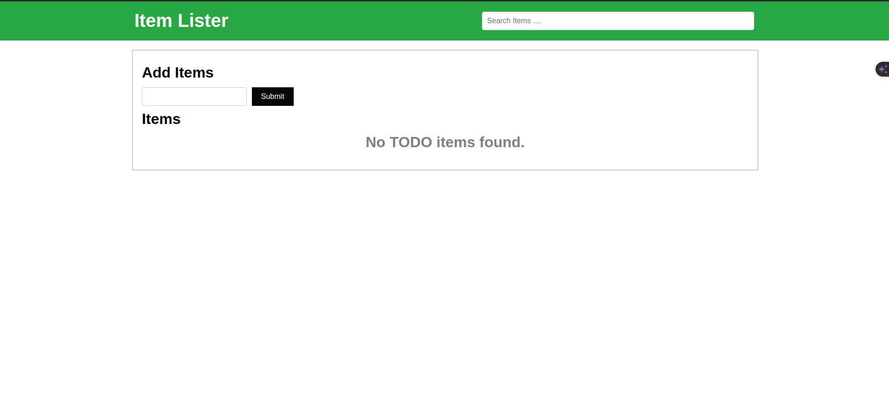
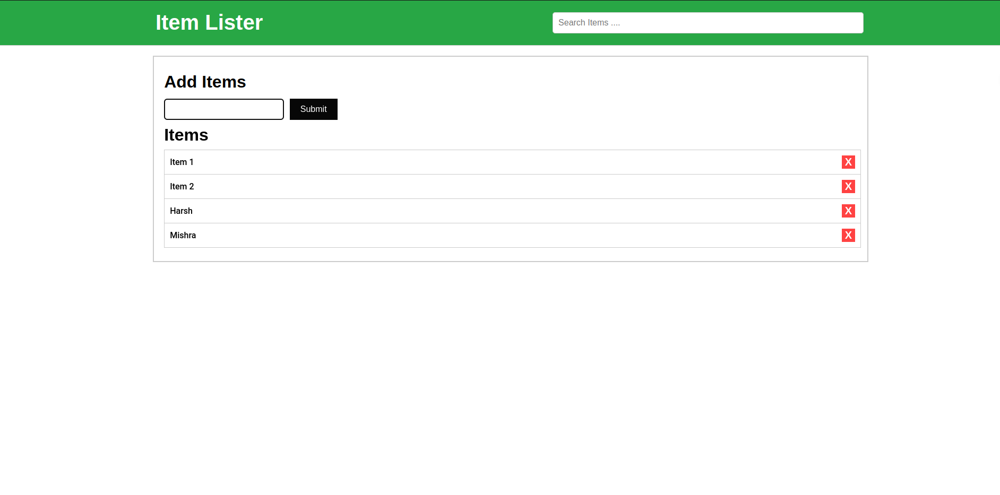
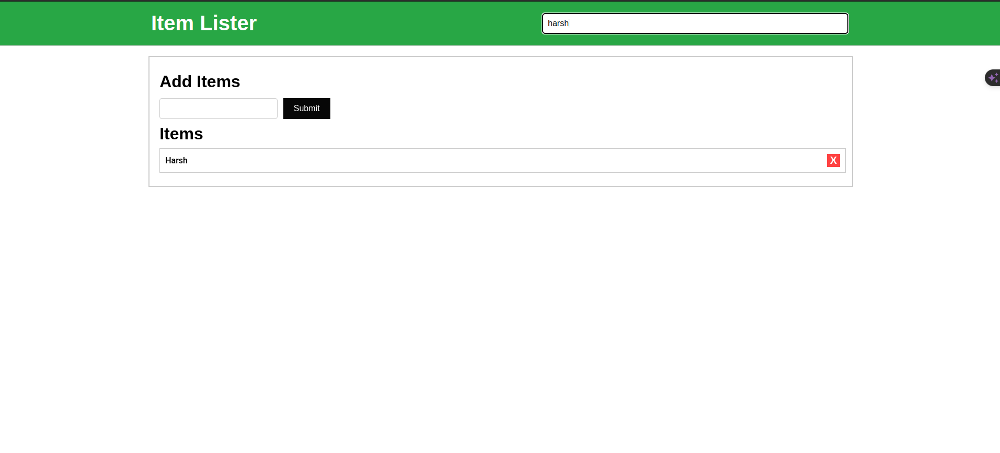
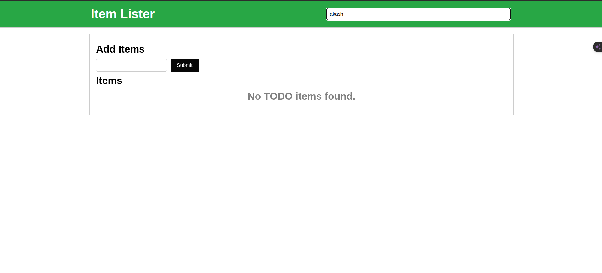
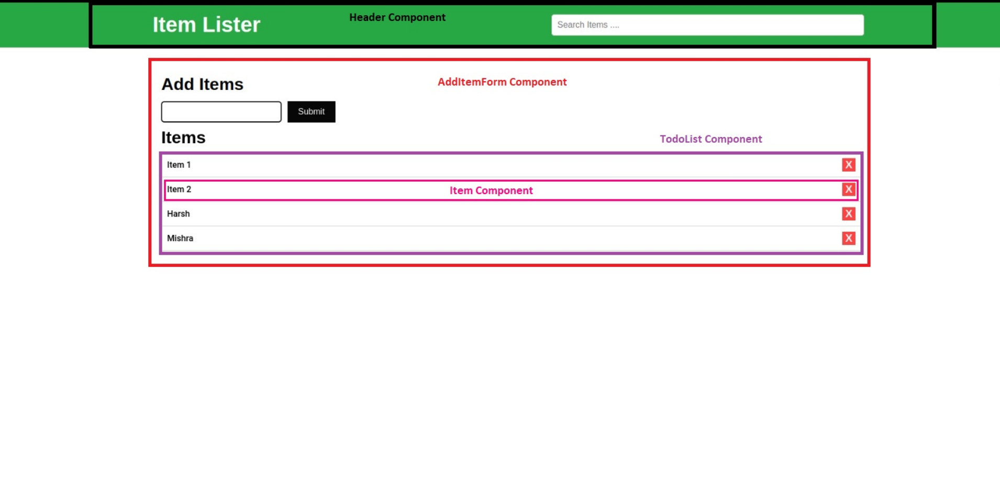

## Todo List App Documentation
- This document presents a detailed overview of the Todo List app's folder structure, components, and their properties .
- It uses context api method instead of prop drilling.

### Folder Structure
```
todo-app-context-api/
├── Components/
│   ├── AddItemForm/
│   │   ├── AddItemForm.tsx
│   │   └── AddItemForm.scss
│   ├── Header/
│   │   ├── Header.tsx
│   │   └── Header.scss
│   └── TodoList/
│   |    ├── TodoList.tsx
│   |    └── TodoList.scss
|   |
|   └── Items.tsx
|        ├── Items.tsx
│        └── Items.scss
|
|── context/
|       ├── TodoContext.tsx
|
├── type.ts // Interface definition for TodoItem
├── App.tsx // Main application component
└── index.js // Entry point for the React application

```
### Components
1. Header (Components/Header/Header.tsx)
Renders the app title and a search input bar.
Handles user input for filtering the todo list.
Props:

- title: string (required) - The title of the app.
- onSearch: (searchTerm: string) => void (optional) - Callback    function triggered when the search term changes.
  
* AddItemForm (Components/AddItemForm/AddItemForm.tsx)
Provides a form for users to add new todo items.
Collects the entered text and adds it to the list upon submission.
Props: onSubmit: (text: string) => void - Callback function invoked when the form is submitted.

* TodoList (Components/TodoList/TodoList.tsx)
Displays the list of todo items with their text, completion status, and actions for deletion and completion toggling.
Props: todos: TodoItem[] - Array of todo items to render.
onDelete: (id: string) => void - Callback function called when a todo is deleted.

- 

2. App (App.tsx)
Main component managing the overall application state and logic.
Handles data persistence (optional), adding, deleting, and filtering todo items, and rendering the other components.
State:

- todos: TodoItem[] - Array of todo items.
- searchTerm: string - Current search term.

3. TodoItem (type.ts)
Interface defining the structure of a todo item.
Properties:

   id: string - Unique identifier for the item.
   text: string - Text content of the item.


### Output : 
### Initially:


### After Adding Items
 


### On searching "Element"


### If item Not Found
   

 #### Components : 
 