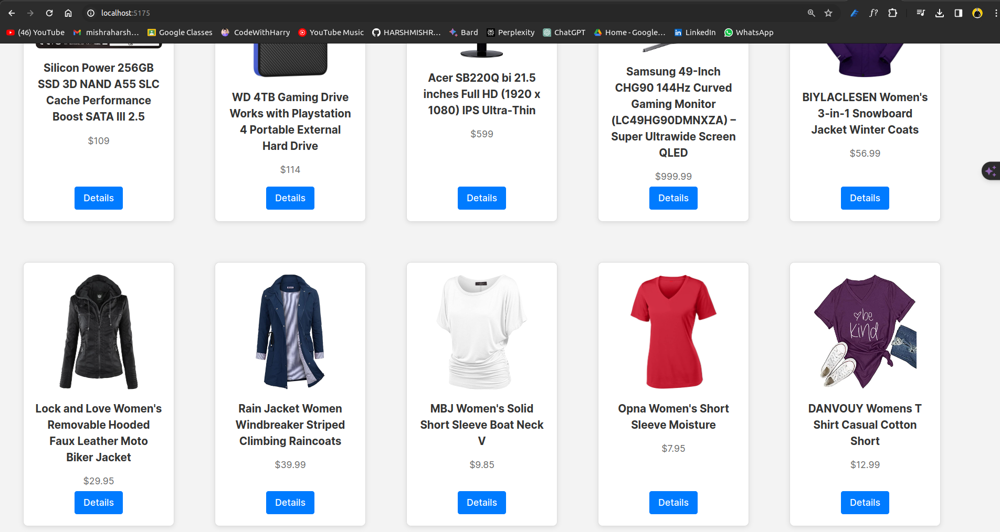

# KDU-MARKETPLACE_ECOMMERCE WEBSITE

## Introduction
KDU Marketplace is an eCommerce platform built with modern web technologies including React, TypeScript, and Vite. The platform showcases a variety of products allowing users to browse through different categories and view detailed information about each product.

## Technologies Used
- **React**: A JavaScript library for building user interfaces.
- **TypeScript**: A typed superset of JavaScript that compiles to plain JavaScript.
- **Vite**: A build tool that aims to provide a faster and leaner development experience for modern web projects.
- **Styled-Components**: Utilized for styling our components in a modular and reusable way.

## Folder Structure


### Explanation of the codebase:
The project is built using React with TypeScript and Vite as a build tool. The `App.tsx` file acts as the entry
The project is built using React and TypeScript with Vite as a module bundler. 


## Folder Structure: 
 ```              
[KDU_Ecommerce_Website/src]
 ✘ ⚙  hp   main -+  tree
.
├── App.css
├── App.tsx
├── components
│   ├── Navbar
│   │   ├── Navbar.styles.ts
│   │   └── Navbar.tsx
│   └── ProductCard
│       ├── ProductCard.styles.ts
│       └── ProductCard.tsx
├── context
│   └── AppContext.tsx
├── index.css
├── main.tsx
├── pages
│   ├── ErrorPage.tsx
│   ├── HomePage
│   │   ├── HomePage.style.ts
│   │   └── HomePage.tsx
│   └── ProductPage
│       ├── ProductPage.style.ts
│       └── ProductPage.tsx
├── styles
│   └── main.scss
├── type
│   └── apptypes.d.ts
├── utils
│   └── fetchData.ts
└── vite-env.d.ts

10 directories, 18 files
```


## Getting Started
To get a local copy up and running follow these simple steps.

### Prerequisites
- Node.js
- npm

### Installation
1. Clone the repo
```
   git clone https://github.com/your_username_/KDU-Marketplace.git

```
- Install NPM packages
```
npm install
```
- Start the development server

```
npm run dev
```
- Features
- Browse products in various categories.
- View detailed information about each product.

### Fork the Project
Create your Feature Branch (git checkout -b feature/AmazingFeature)
Commit your Changes (git commit -m 'Add some AmazingFeature')
Push to the Branch (git push origin feature/AmazingFeature)
Open a Pull Request


### AUTHOR
## Harsh Mishra

## Screenshots : 
### Home page :
- 
  
- 

- 


###  Product Detail Page


#### While changing the id on the url we can also change the produc page : 


## Search Working


### Sorted According to Price ASC


### Sorted  according to Price DESC


## Author 
### Harsh Mishra