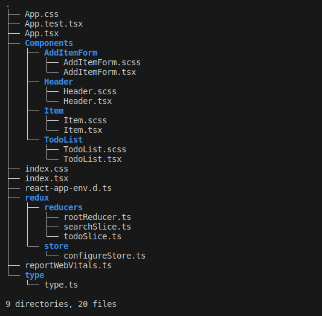
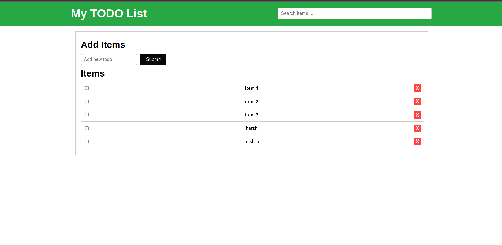
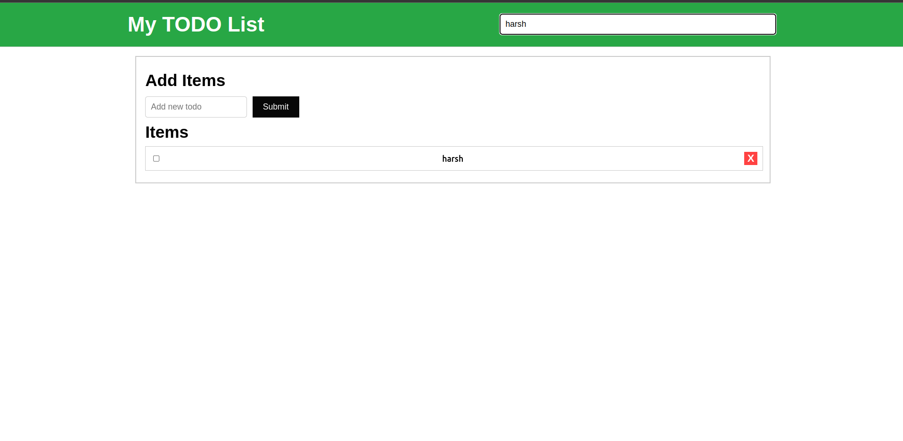
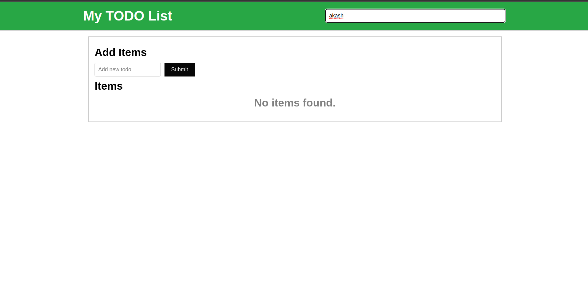
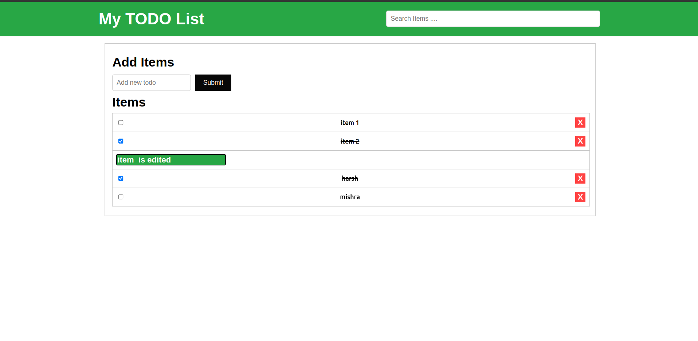
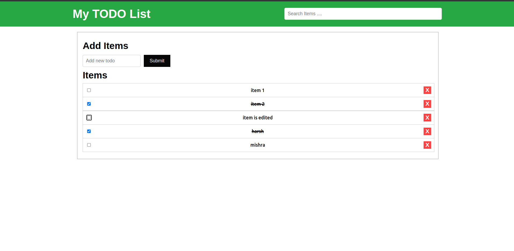

## Todo List App Documentation
This document presents a detailed overview of the Todo List app's folder structure, components, and their properties. The application leverages Redux for state management to handle the application's state more predictably and to manage the actions like adding, toggling, deleting, and searching todos efficiently.

### Folder Structure

### Components
1. **Header** (`Components/Header/Header.tsx`)
   - Renders the app title and a search input bar.
   - Dispatches action to filter the todo list based on user input.
   - Props:
     - `title`: string (required) - The title of the app.

2. **Item** (`Components/Item/Item.tsx`)
   - Displays individual todo items with their text, completion status, and actions for editing, deletion, and completion toggling.
   - Props:
     - `todo`: TodoItem (required) - The todo item to render.
     - `onDelete`: (id: string) => void (required) - Callback function called when a todo is deleted.

3. **TodoList** (`Components/TodoList/TodoList.tsx`)
   - Displays the list of filtered todo items based on the search term.
   - Props: None - Utilizes Redux state for todos and search term.

4. **App** (`App.tsx`)
   - Main component managing the overall application layout.
   - Utilizes Redux store for managing application state including todos and search term.

### Redux Structure
- **TodoSlice** and **SearchSlice** manage the state of todo items and the search term, respectively.
- The **rootReducer** combines different reducers.
- The **store** configures the Redux store with the rootReducer.

### Types
- **TodoItem** (`types/type.ts`)
  - Interface defining the structure of a todo item.
  - Properties:
    - `id`: string - Unique identifier for the item.
    - `text`: string - Text content of the item.
    - `completed`: boolean - Completion status of the item.

### Output
#### Initially:

#### After Adding Items

#### On searching "Element"

#### If item Not Found

#### if item is toggle

#### if item is edited

#### after editing

### Author
## Harsh Mishra