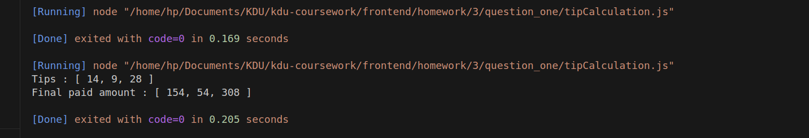

### question:
- Q1) Jack went on a holiday and went to 3 different restaurants. 

The bills were: $140, $45 and $280.

Make a function “tipCalculator” which would help Jack to calculate the tip

He likes to tip: 

20% of the bill when the bill is less than $50, 

15% when the bill is between $50 and $200, 

10% if the bill is more than $200.

Output the following 2 arrays :

a) Containing all three tips (one for each bill)

b) Containing all three final paid amounts (bill + tip).

### output of the code is : 

