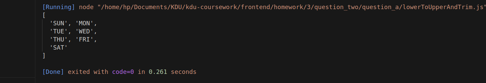

### question:
-  a) ["Sunday "," Monday ",
" Tuesday","Wednesday "," Thursday "," Friday",
"Saturday "]
Convert the above array into a trimmed abbreviated uppercase array i.e.
['SUN', 'MON','TUE', 'WED','THU', 'FRI','SAT']

### output : 

