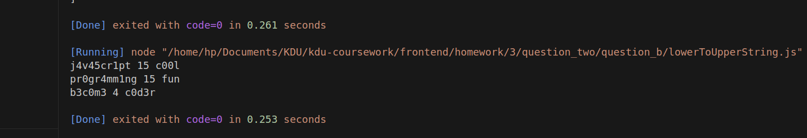

### question
- Create a function that takes a string as an argument and returns a coded version of the string. And remove spaces at the beginning and end of the string. The function should replace all 'a's with 4, 'e's with 3, 'i's with 1, 'o's with 0, and 's's with 5.

Test Cases : 

INPUT:  "javascript is cool  "   OUTPUT "j4v45cr1pt 15 c00l"

INPUT:  "programming is fun"    OUTPUT "pr0gr4mm1ng 15 fun"

INPUT:  "  become a coder"     OUTPUT "b3c0m3 4 c0d3r"

### output: 
