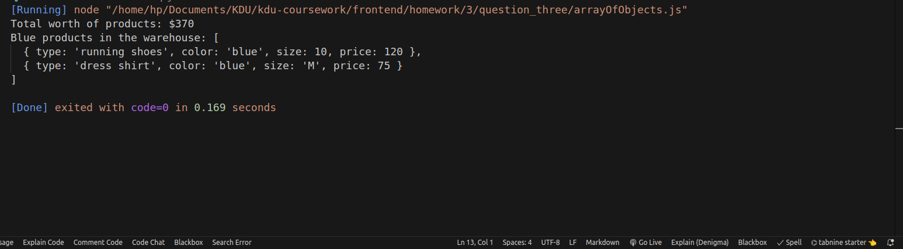

## Question : 
Q3) Create the following arrays of objects :
shoes - should have 2 shoe objects,
shirts - should have 3 shirt objects
Objects should have the following attributes : type, color, size, price.
a) Create a warehouse array and add all the objects from the above arrays to it.
b) Calculate the total worth of products stored in the warehouse.
c) Sort the warehouse array in descending order of prices of products in it.
d) Display the warehouse products which are blue in color.

## Solution : 
