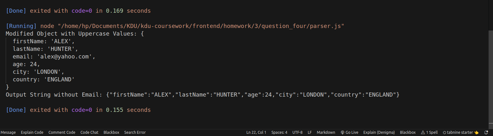

## Question : 

Q4) Consider the following input string :
'{"firstName":"Alex","lastName":"Hunter","email":"alex@yahoo.com","age
":24, "city":"london", "country":"england"}'

a) Convert the input string into a JSON object where all the values are converted to
uppercase except the email.
Expected Output : {
firstName: 'ALEX',
lastName: 'HUNTER',
email: 'alex@yahoo.com',
age: 24,
city: 'LONDON',
country: 'ENGLAND'
}

b) Take the above generated object and convert it back into a string without the “email”
key-value pair.
Expected Output :
{"firstName":"ALEX","lastName":"HUNTER","age":24,"city":"LONDON","country":"ENGLAND"}

## Output: 

