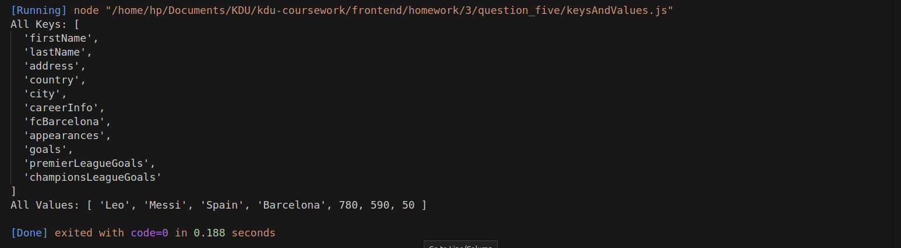

## Question : 
Q5) Consider the following object :
player = {
firstName: "Leo",
lastName: "Messi",
address: {
country: "Spain",
city: "Barcelona",
},
careerInfo: {
fcBarcelona: {
appearances: 780,
goals: {
premierLeagueGoals: 590,
championsLeagueGoals: 50,
},
},
},
};
Output the following for this object :
a) All the keys
b) All the values
c) The function should be generic.It should work on all objects, not just the given object

## Output: 
