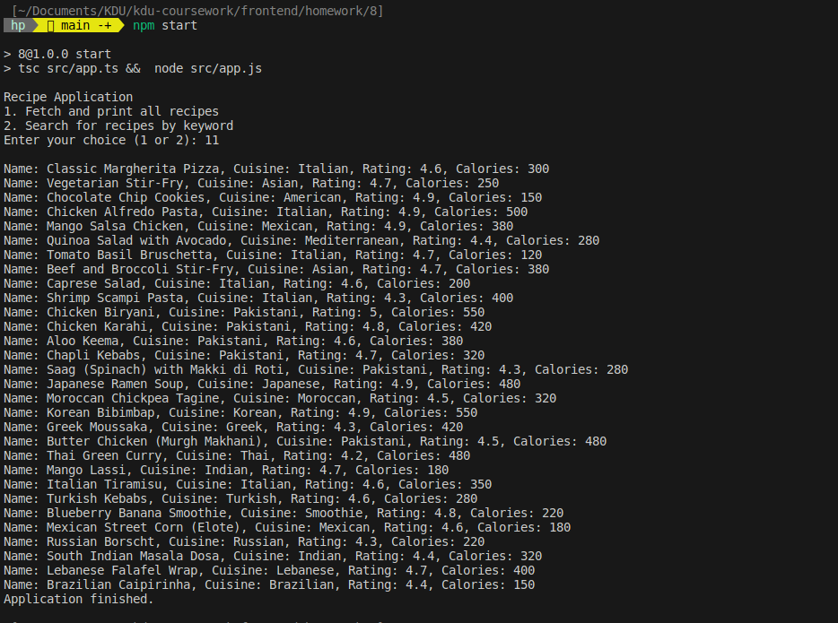
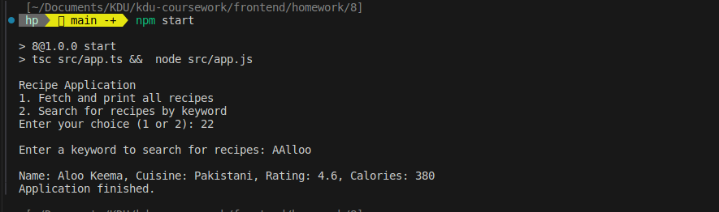

<!-- Homework 8 -->

# Recipe Finder Application

This Recipe Finder Application is a Node.js based command-line application that allows users to fetch and search for recipes using the `dummyjson.com/recipes` API. Users can either view all available recipes or search for recipes by keywords.

## Features

- Fetch and display a list of recipes.
- Search for recipes based on a keyword.

## Prerequisites

- Node.js
- npm (Node Package Manager)

## Installation

To set up the project on your local machine, follow these steps:

1. Clone the repository to your local machine.
2. Navigate to the project directory.
3. Install the dependencies by running:

```
npm install
```
- Ensure you have TypeScript installed globally, or install it as a dev dependency:
  ```
  npm install -g typescript
```
- or
```
npm install --save-dev typescript

```
## Usage
To start the application, use the npm start command defined in your package.json. This command compiles the TypeScript code and then executes the compiled JavaScript code.

- The scripts section in your package.json should include:

```
"scripts": {
  "start": "tsc src/app.ts && node src/app.js"
}

```

- After setting up the scripts, run the following command in the terminal:
```
npm start

```

ou will be prompted with two options:

- Fetch and print all recipes: Displays a list of all available recipes with their details.
- Search for recipes by keyword: Allows you to enter a keyword to search for related recipes.
#### Commands
- Enter your choice (1 or 2): Enter 1 to fetch all recipes or 2 to search for recipes by keyword.
- Enter a keyword to search for recipes: After selecting 2, enter the keyword for searching recipes.
## Project Structure

```
project-root/
│
├── src/
│   ├── app.ts         # Main application entry point
│   └── models/
│       └── Recipe.ts  # Recipe model definition
│
├── package.json       # Project metadata and dependencies
└── tsconfig.json      # TypeScript configuration

```

### Dependencies
- axios: Used for making HTTP requests to the API.
- readline: Used for reading input from the command line.
### Models
-  `Recipe`: This class represents a single recipe. It has properties such as title, ingredients, instructions, etc., which are accessed via getter  methods. The constructor takes an object
The project uses a single `Recipe` class as its data structure. This class is defined
The Recipe model contains the following properties:

- name: Name of the recipe.
- cuisine: Cuisine type.
- rating: Recipe rating.
- caloriesPerServing: Calories per serving.
### API
- This application uses the https://dummyjson.com/recipes API to fetch and search recipes.

### Author
**HARSH MISHRA**

## output:

